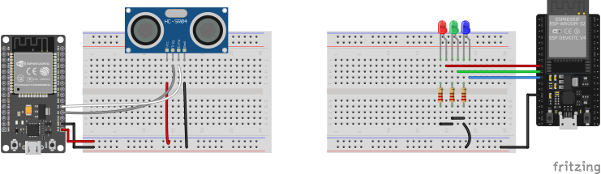
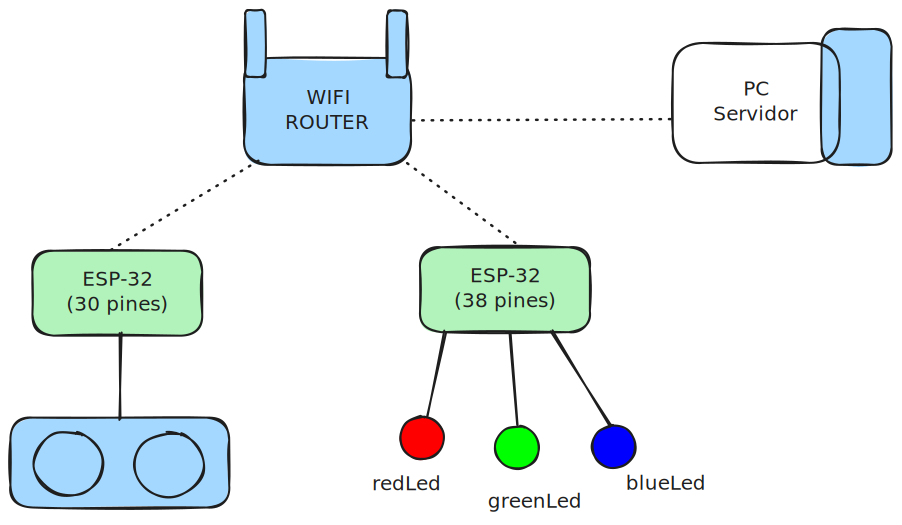
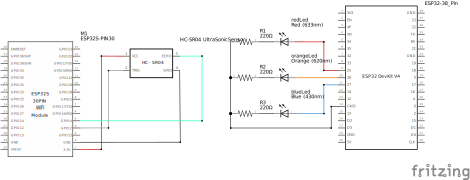

# Practica 2 IoT

## Integrantes
- Rocha
- Quiroga
  
  ## Indice
  - [Practica 2 IoT](#practica-2-iot)
  - [Integrantes](#integrantes)
  - [Indice](#indice)
    - [Descripción](#descripción)
    - [Objetivos](#objetivos)
    - [Protocolo de Aplicacion](#protocolo-de-aplicacion)
    - [Diagramas](#diagramas)


  ### Descripción

### Objetivos

### Protocolo de Aplicacion
- Comandos
  - GET ITERVALS
    - Arguments:None
    - Return:
      - 0,0,10
      - 1,10,20
      - 2,20,30
      - -1

  ### Diagramas
- Diagrama del prototipo
    - 
- Diagrama de arquitectura
  - 
- Diagrama de Clases
  - ESP30 Pins (Led Controller)
    - ```mermaid
          classDiagram
            direction RL
            class Led{
              -ledPin : byte
              -actualState : bool 
              -finalState : byte
              -previousMillis : unsigned long 
              -interval : unsigned long
              +STATE_ON : byte$
              +STATE_OFF : byte$
              +STATE_BLINK : byte$
              -turnOn() void
              -turnOff() void
              -blink() void
              +setBlinksPerSecond(byte bps) void
              +setState(byte state) void
              }
            Controller <-- LedController
            LedController --> Led
            Controller : +setState() virtual void
            Controller: + setAllStates() virtual void
            class LedController{
              -leds : Led[]
              +setAllStates(byte state) void
              +setState(byte ledIndex, byte state) void
            }      
      ``` 
  - ESP38 Pins (UltraSonicSensor)
    - ```mermaid
                classDiagram
                    direction RL
                    class UltraSonicSensor{
                      -trigerPin : byte
                      -echoPin : byte
                      -getDistance() long
                      +getDistanceCm() int
                    }
      ```
  - Server(Python)
    - ```mermaid
              classDiagram
              direction RL

      ```
- Diagrama de comportamiento
  - ```mermaid
          %%{init: {'theme':'neutral'}}%%
            sequenceDiagram
                Participant A as SERVER
                Note left of A: Conect to wifi
                Note left of A: Server start
                Participant B as ESP-32(30 pins)
                Note left of B: Conect to wifi
                Participant C as UltraSonicSensor
                Participant D as ESP-32(38 pins)
                Note left of D: Conect to wifi
                Participant E as LedController
                Note over  E: if(interval == 0) setAllLeds(STATE_ON);
                Note over  E: if(interval == 1) setAllLeds(STATE_OFF) <br> setLed(redLedPin,STATE_ON)
                Note over  E: if(interval == 2) setAllLeds(STATE_OFF) <br>setLed(redLedPin,STATE_ON)
                Note over  E: if(interval == -1) setAllLeds(STATE_OFF); 
                Participant F as redLed
                Participant G as greenLed
                Participant H as blueLed
                B->>+A: GET INTERVALS
                A-->>-B:RESPONSE: [0,0,10,1,10,20,2,20,30,-1]
                loop when Interval changed
                    loop when distance change
                        C-->>+B:getDistance()
                        B->>-C:theDistance change the interval?
                        alt True
                            B-->>+B:change Interval
                        end
                    end
                    B->>+A: POST: ACTUAL_INTERVAL
                    A-->>-B:RESPONSE: OK
                    A->>+D: POST: ACTUAL_INTERVAL
                end
                D-->>-A:RESPONSE: OK
                alt ACTUAL_INTERVAL == 0
                    D->>+E:setAllLeds(STATE_ON)
                    E->>+F:turnOn()
                    E->>+G:turnOn()
                    E->>+H:turnOn()
                    E-->>-D: RESPONSE: allLeds are turn on
                else ACTUAL_INTERVAL == 1
                    D->>+E:setAllLeds(STATE_OFF) <br>setLed(redLedPin, STATE_ON)
                    E->>+F:turnOff()
                    E->>+G:turnOff()
                    E->>+H:turnOff()
                    E->>+F:turnOn()
                    E-->>-D: RESPONSE: only redLed is turn on
                else ACTUAL_INTERVAL == 2
                    D->>+E:setAllLeds(STATE_OFF) <br>setLed(gree LedPin, STATE_ON)
                    E->>+F:turnOff()
                    E->>+G:turnOff()
                    E->>+H:turnOff()
                    E->>G:turnOn()
                    E-->>-D: RESPONSE: only greenled is turn on
                else ACTUAL_INTERVAL == -1
                    D->>+E:setAllLeds(STATE_OFF) <br>setLed(blueLedPin, STATE_ON)
                    E->>+F:turnOff()
                    E->>+G:turnOff()
                    E->>+H:turnOff()
                    E->>H:turnOn()
                    E-->>-D: RESPONSE: only blueLed is turn on
                end
      ```

- Diagrama de Circuitos
  - 
