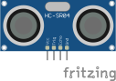
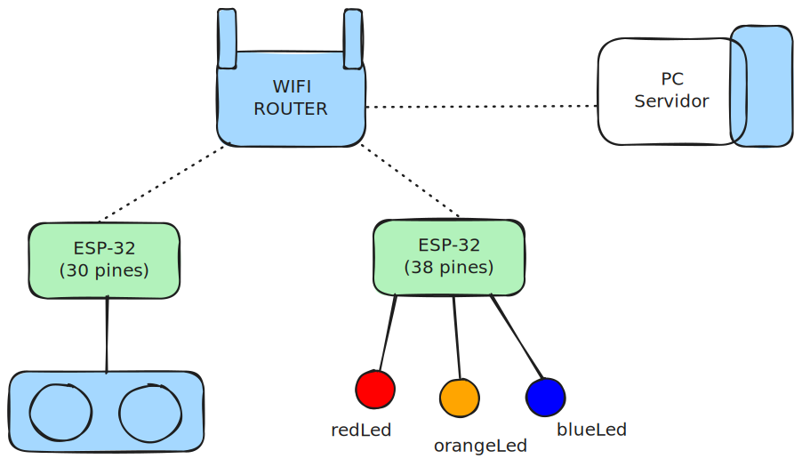

# Practica 2 IoT
<style>
  img{
    background-color: #fff;
  }
</style>
## Integrantes
- Rocha
- Quiroga
- La Torre
  
  ## Indice
- [Practica 2 IoT](#practica-2-iot)
  - [Integrantes](#integrantes)
  - [Indice](#indice)
    - [Descripción](#descripción)
    - [Objetivos](#objetivos)
    - [Protocolo de Aplicacion](#protocolo-de-aplicacion)
    - [Materiales](#materiales)
    - [Diagramas](#diagramas)


  ### Descripción

### Objetivos

### Protocolo de Aplicacion
- Comandos
  - GET ITERVALS
    - Arguments:None
    - Return:
      - 0,0,10
      - 1,10,20
      - 2,20,30
      - -1

### Materiales
- ESP32(30pins)
  - 
- ESP32(38pins)
  - 
- LED
  -   
- Resistor 220$\Omega$
  - 
- UltraSonicSensor
  - 


  ### Diagramas
- Diagrama del prototipo
    - 
- Diagrama de arquitectura
  - 

- Diagrama de Circuitos
  - 
- Diagrama de Clases
  - ESP30 Pins (Led Controller)
    - ```mermaid
         %%{init: {'theme':'neutral'}}%%
            classDiagram
            direction RL
            class Led{
              -m_pin : uint8_t$
              -m_currentState : State
              -m_isOn : bool 
              -m_blinkInterval : uint32_t
              -m_previousMillis : uint32_t
              -interval : unsigned long
              +ON : enum class State$
              +OFF : enum class State$
              +BLINK : enum class State$
              -turnOn() void
              -turnOff() void
              -blink() void
              -applyState() void
              -toggle() void
              -handleBlink() void
              +getPin() uint8_t$
              +update() void
              +setBlinksPerSecond(uint16_t blinksPerSecond)
              +setState(byte state) void
              }
            
            class Controller~typename T, typename U~{
                +setAllStates(T state) virtual void
                +setState(T state,U id) virtual void
            }

            Controller --> LedController

            LedController --> Led
            class LedController{
              -m_leds : Led[]
              -m_numLeds : uint8_t$
              -m_firstPin : uint8_t$
              +setAllStates(byte state) void
              +setState(byte ledIndex, byte state) void
              +getLedPin(uint8_t index) uint8_t$
              +updateAll() void
              +getLedCount() uint8_t$
              +getFirstPin() uint8_t$ 
            } 
      ``` 
    - ```mermaid
         %%{init: {'theme':'neutral'}}%%
                classDiagram
                    direction RL
                    class LedExecute{
                        -client : ServerClient
                        -leds : Led[]
                        -actualInterval : byte
                        -wireLed : LedController
                        -ssid : char*$
                        -password : char*$
                        -lastUpdate: unsigned long
                        -SENSOR_ID_TO_GET : uint16_t$
                        -updateLedState(byte newInterval) void
                        -checkSensorInterval() void
                        +setup() void
                        +loop() void
                    }
                    LedExecute <-- ServerClient
                    LedExecute <-- LedController
                    LedExecute <-- Led
        ```
  - ESP38 Pins (UltraSonicSensor)
    - ```mermaid
           %%{init: {'theme':'neutral'}}%%
                classDiagram
                    direction RL
                    class UltraSonicSensor{
                      -trigerPin : byte
                      -echoPin : byte
                      -SENSOR_ID : uint16_t
                      -measureEchoTime() int
                      +getDistanceUs() int
                      +setSensorId() void
                      +getDistanceCm() int
                      +getSensorId() uint16_t
                    }
      ```
    - ```mermaid
           %%{init: {'theme':'neutral'}}%%
                classDiagram
                    direction RL
                    class SensorExecute{
                      -mySensor : UltraSonicSensor
                      -client : ServerClient
                      + setup() void
                      + loop() void
                    }
                    SensorExecute <--UltraSonicSensor
                    SensorExecute <--ServerClient
      ```
  - ServerClient
    - ```mermaid
           %%{init: {'theme':'neutral'}}%%
                classDiagram
                    direction RL
                    class ServerClient{
                      +Resource : enum
                      +Command : enum
                      +Status : enum
                      -m_host : const char
                      -m_port : unit_16
                      -isConnected : bool
                      +wifiConnect((const char*, const char* ) bool
                      +connectToServer() bool
                      +get(Resource, uint16_t) bool
                      +post(Resource, uint16_t, const uint8_t*, uint32_t) bool
                      +update(Resource, uint16_t, const uint8_t*, uint32_t) bool
                      +disconnectToServer() bool
                      +isConnected() bool
                      +reciveStatus() bool
                      +reciveData(Resource, uint16_t, char*, size_t) bool
                      -sendPacket(byte,byte,uint16_t,uint8_t,uint32_t) bool
                    }
      ```
  - Server
    - ```mermaid
            classDiagram
            %%{init: {'theme':'neutral'}}%%
                    direction RL
                    class ESPCRUDProtocol{
                        -host : string
                        -port : string
                        -data_store : json
                        -lock : threading.Lock
                        -running : bool
                        -server_socket : socket
                        -POST : Command$
                        -GET : Command$
                        -UPDATE : Command$
                        -DELETE : Command$
                        -SENSOR : Resource$
                        -LED : Resource$
                        -OK : Status$
                        -ERROR : Status$
                        -NOT_FOUND : Status$
                        +_handlePacket(self,conn)
                        +_process_command(self, cmd, res, dev_id, data)
                        +_client_handler(self, conn, addr)
                        +start(self)
                    }
                    class Command
                    class Resource
                    class Status
                    Command --> ESPCRUDProtocol
                    Resource --> ESPCRUDProtocol
                    Status --> ESPCRUDProtocol
      ```
- Diagrama de comportamiento
  - ```mermaid
    %%{init: {'theme':'dark'}}%%
              sequenceDiagram
                Participant A as SERVER
                Note left of A: Conect to wifi
                Note left of A: Server start
                Participant B as ESP-32(SensorExecute)
                Note left of B: Conect to wifi
                Participant C as UltraSonicSensor
                Participant D as ESP-32(LedExecute)
                Note left of D: Conect to wifi
                Participant E as LedController
                Note over  E: if(interval == 0) setAllLeds(STATE_OFF)
                Note over  E: if(interval == 1) setAllLeds(STATE_OFF) <br> setState(blueLedPin,STATE_ON)
                Note over  E: if(interval == 2) setAllLeds(STATE_OFF) <br>setState(orangeLedPin,STATE_ON)
                Note over  E: if(interval == 3) setAllLeds(STATE_OFF) <br>setState(redLedPin,STATE_ON)
                Participant F as blueLed
                Participant G as orangeLed
                Participant H as redLed
                B->>+A:connectToServer()
                A-->>-B:conectionStatus
                B->>+A:POST : SENSOR, SENSOR_ID ACTUAL_INTERVAL sizeof(ACTUALINTERVAL)
                A-->>-B:RESPONSE: STATUS
                loop when Interval changed
                    loop when distance change
                        C->>+B:getDistance()
                        B-->>-C:theDistance change the interval?
                        alt True
                            B-->>+B:change Interval
                        end
                    end
                    B->>+A: UPDATE : SENSOR, SENSOR_ID ACTUAL_INTERVAL sizeof(ACTUALINTERVAL)
                    A-->>-B:RESPONSE: STATUS
                end
                D->>+A: POST : LED_RES, blueLedPin, Led::STATE_OFF,sizeof(Led::STATE)
                D->>A: POST : LED_RES, orangeLedPin, Led::STATE_OFF,sizeof(Led::STATE)
                D->>A: POST : LED_RES, redLedPin, Led::STATE_OFF,sizeof(Led::STATE)
                A-->>-D:RESPONSE : STATUS
                loop when timeout pass
                    D->>+A: GET : RES_SENSOR, SENSOR_ID, responseVariable, sizeof(RESPONSE)
                    A-->>-D: RESPONSE:responseVariable = ACTUAL_INTERVAL
                end
                alt ACTUAL_INTERVAL == 0
                    D->>+E:setAllLeds(STATE_OFF)
                    E->>+F:turnOff()
                    E->>+G:turnOf()
                    E->>+H:turnOf()
                    E-->>-D: RESPONSE: STATUS
                    D->>+A: UPDATE : LED_RES, blueLedPin, Led::STATE_OFF,sizeof(Led::STATE)
                    D->>A: UPDATE : LED_RES, orangeLedPin, Led::STATE_OFF,sizeof(Led::STATE)
                    D->>A: UPDATE : LED_RES, redLedPin, Led::STATE_OFF,sizeof(Led::STATE)
                    A-->>-D: RESPONSE: STATUS
                else ACTUAL_INTERVAL == 1
                    D->>+E:setAllState(STATE_OFF) <br>setState(blueLedPin, STATE_ON)
                    E->>+F:turnOff()
                    E->>+G:turnOff()
                    E->>+H:turnOff()
                    E->>+F:turnOn()
                    E-->>-D: RESPONSE: STATUS
                    D->>+A: UPDATE : LED_RES, blueLedPin, Led::STATE_ON,sizeof(Led::STATE)
                    D->>A: UPDATE : LED_RES, orangeLedPin, Led::STATE_OFF,sizeof(Led::STATE)
                    D->>A: UPDATE : LED_RES, redLedPin, Led::STATE_OFF,sizeof(Led::STATE)
                    A-->>-D: RESPONSE: STATUS
                else ACTUAL_INTERVAL == 2
                    D->>+E:setAllState(STATE_OFF) <br>setState(orangeLedPin, STATE_ON)
                    E->>+F:turnOff()
                    E->>+G:turnOff()
                    E->>+H:turnOff()
                    E->>G:turnOn()
                    E-->>-D: RESPONSE: STATUS
                    D->>+A: UPDATE : LED_RES, blueLedPin, Led::STATE_OFF,sizeof(Led::STATE)
                    D->>A: UPDATE : LED_RES, orangeLedPin, Led::STATE_ON,sizeof(Led::STATE)
                    D->>A: UPDATE : LED_RES, redLedPin, Led::STATE_OFF,sizeof(Led::STATE)
                    A-->>-D: RESPONSE: STATUS
                else ACTUAL_INTERVAL == 3
                    D->>+E:setAllState(STATE_OFF) <br>setState(redLedPin, STATE_ON)
                    E->>+F:turnOff()
                    E->>+G:turnOff()
                    E->>+H:turnOff()
                    E->>H:turnOn()
                    E-->>-D: RESPONSE: STATUS
                    D->>+A: UPDATE : LED_RES, blueLedPin, Led::STATE_OFF,sizeof(Led::STATE)
                    D->>A: UPDATE : LED_RES, orangeLedPin, Led::STATE_OFF,sizeof(Led::STATE)
                    D->>A: UPDATE : LED_RES, redLedPin, Led::STATE_ON,sizeof(Led::STATE)
                    A-->>-D: RESPONSE: STATUS
                end
    ```